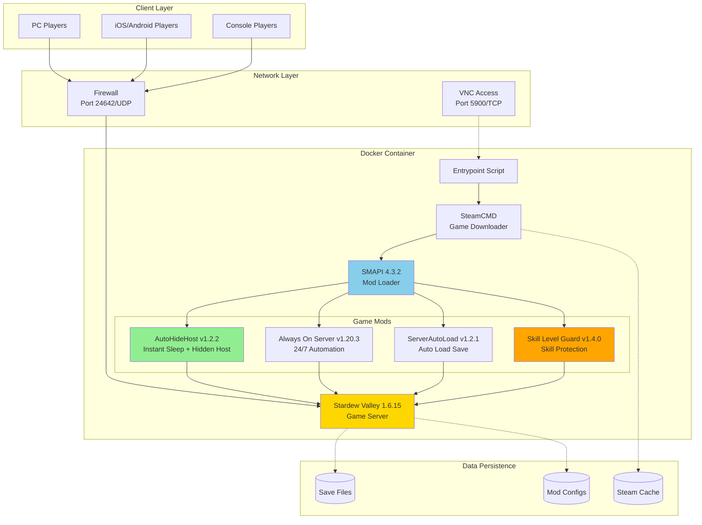

<div align="center">

<table>
<tr>
<td width="30%" align="center">
  
</td>
<td width="70%">

# Puppy Stardew Server
## One-Command Stardew Valley Multiplayer Server

[](https://hub.docker.com/r/truemanlive/puppy-stardew-server)
[](https://hub.docker.com/r/truemanlive/puppy-stardew-server)
[](https://github.com/truman-world/puppy-stardew-server)
[](LICENSE)

English | [中文](README_CN.md)

**One-Command Deployment | Cross-Platform Multiplayer Support**

</td>
</tr>
</table>

</div>

---

## Project Architecture



## Deploy Your Stardew Valley Server in 3 Minutes

Setting up a **Stardew Valley dedicated server** has never been easier! With **one simple command**, you can have your own 24/7 multiplayer server running on **any platform** - PC, Mac, Linux, iOS, and Android players can all join together.

**Perfect for:**
- **Remote Multiplayer** - Play with friends anywhere in the world
- **Cross-Platform Gaming** - iOS, Android, and PC players together
- **24/7 Always-On Server** - Join anytime, no need for host to be online
- **Easy Setup** - One command deployment with Docker Compose
- **Low Resource Usage** - Runs smoothly on just 2GB RAM

## Key Features

- **One-Command Deploy** - Deploy in 3 minutes with a single command
- **Cross-Platform Support** - PC, Mac, Linux, iOS, Android all supported
- **24/7 Dedicated Server** ⚡ - Runs independently without requiring the host to be online
- **Docker Compose** - Easy deployment and management
- **Resource Efficient** - Runs smoothly on servers with only 2GB RAM
- **Auto-Save Loading** - Automatically loads your save on server restart
- **VNC Remote Access** 🖥️ - Built-in VNC for easy first-time setup
- **Instant Sleep** - Bonus feature: Players can sleep at any time without waiting
- **Hidden Host** - Host player is automatically hidden for seamless gameplay
- **Skill Protection** 🛡️ - NEW: Prevents level anomalies, maintains natural progression

<div align="center">


*Bonus Feature: Instant sleep - Click bed → Sleep instantly → New day begins!*

</div>

## What's New in Latest Version

### v1.0.58 (November 9, 2025)

**Skill Level Guard v1.4.0 - Major Fix:**
- **✅ FIXED:** Always On Server auto-enable works correctly after container restart
- **NEW:** ToggleAutoMode method invocation via reflection for Auto Mode activation
- **VERIFIED:** Game pauses correctly when no players are connected, ServerAutoLoad works seamlessly
- **MAINTAINED:** Skill level protection continues to work, XP-based level calculation preserved

**Core Improvements:**
- Fully automated Always On Server enablement workflow
- No manual F9 or VNC intervention required
- Game automatically pauses after container restart, awaiting player connections

## Quick Start

### Watch the One-Command Deployment in Action

[](https://asciinema.org/a/SYBS2qWsb5ZlSolbFPuoA7EJY)

### Option 1: One-Command Deployment (Recommended for Beginners)

**English Version:**

```bash
curl -sSL https://raw.githubusercontent.com/truman-world/puppy-stardew-server/main/quick-start.sh | bash
```

The script will:
- Check your Docker installation
- Guide you to enter Steam credentials
- Create all necessary directories with correct permissions
- Generate configuration files
- Start the server
- Show you connection information

**That's it!** ☕ Grab a coffee while it downloads the game (~1.5GB).

<details>
<summary><h3>Option 2: Manual Setup (For Advanced Users)</h3></summary>

#### Prerequisites

- Docker and Docker Compose installed
  - **Quick install** (Linux): `curl -fsSL https://get.docker.com | sh`
  - **Or follow official guide**: [Get Docker](https://docs.docker.com/get-docker/)
- A Steam account **with Stardew Valley purchased**
- 2GB RAM minimum, 4GB recommended
- 2GB free disk space

#### Step 1: Download Configuration Files

```bash
# Clone the repository
git clone https://github.com/truman-world/puppy-stardew-server.git
cd puppy-stardew-server

# Or download files directly
mkdir puppy-stardew && cd puppy-stardew
wget https://raw.githubusercontent.com/truman-world/puppy-stardew-server/main/docker-compose.yml
wget https://raw.githubusercontent.com/truman-world/puppy-stardew-server/main/.env.example
```

#### Step 2: Configure Environment

```bash
# Copy environment template
cp .env.example .env

# Edit with your Steam credentials
nano .env  # or use your favorite editor
```

**`.env` example:**
```env
STEAM_USERNAME=your_steam_username
STEAM_PASSWORD=your_steam_password
ENABLE_VNC=true
VNC_PASSWORD=stardew123
```

**Important**: You MUST own Stardew Valley on Steam. Game files are downloaded via your account.

#### Step 3: Initialize Data Directories

**CRITICAL: This step prevents "Disk write failure" errors!**

```bash
# Run the initialization script (Recommended)
./init.sh

# Or manual setup
mkdir -p data/{saves,game,steam,logs}
chown -R 1000:1000 data/
```

#### Step 4: Start the Server

```bash
# Start the server
docker compose up -d

# View logs
docker logs -f puppy-stardew
```

**If Steam Guard is enabled**, you'll need to enter the code:

```bash
docker attach puppy-stardew
# Paste your Steam Guard code and press ENTER
# IMPORTANT: No output will be shown - this is normal!
# Wait a few seconds, game download will start automatically
# Press Ctrl+P Ctrl+Q to detach (NOT Ctrl+C!)
```

</details>

## Initial Setup (First Run Only)

After the server starts, you need to create or load a save file **once**:

1. **Connect to VNC:**
   - Address: `your-server-ip:5900`
   - Password: The `VNC_PASSWORD` from your `.env` file
   - VNC Client: [RealVNC](https://www.realvnc.com/en/connect/download/viewer/), [TightVNC](https://www.tightvnc.com/), or any VNC viewer

2. **In the VNC window:**
   - Create a new farm, or
   - Load an existing save

3. **Once loaded:**
   - The ServerAutoLoad mod will remember your save
   - Future restarts will auto-load this save
   - Always On Server will automatically enable Auto Mode
   - You can disconnect from VNC

4. **Players can now connect!**
   - Open Stardew Valley
   - Click "Co-op" → "Join LAN Game"
   - Your server should appear in the list automatically
   - Or manually enter your server IP: `192.168.1.100` (example)
   - **Important**:
     - Just enter IP address, **NO port number needed** (not `192.168.1.100:24642`)
     - Port 24642/UDP is used automatically
     - For internet play with port forwarding, forward **UDP** protocol (not TCP)

## What's Inside

### Pre-installed Mods

| Mod | Version | Purpose | Key Features |
|-----|---------|---------|--------------|
| **Always On Server** | v1.20.3 | Keeps server running 24/7 without host player | Headless server operation |
| **AutoHideHost** | v1.2.2 | Custom mod - Hides host player and enables instant sleep | Seamless day-night transitions |
| **ServerAutoLoad** | v1.2.1 | Custom mod - Automatically loads your save on startup | No manual VNC loading needed |
| **✨ Skill Level Guard** | v1.4.0 | **NEW** - Prevents forced Level 10 bug & enables auto-activation | XP-based level calculation + Auto Mode activation |

**What's New in v1.0.58:**
- 🎉 **Fixed**: Always On Server auto-enables correctly after container restart
- ✅ **Added**: Skill Level Guard v1.4.0 with ToggleAutoMode invocation via reflection
- ✅ **Verified**: Game pauses when no players connected
- ✅ **Tested**: ServerAutoLoad and Always On Server work seamlessly together

All mods are pre-configured and ready to use!

## Common Tasks

<details>
<summary><b>View Server Logs</b></summary>

```bash
# Real-time logs
docker logs -f puppy-stardew

# Last 100 lines
docker logs --tail 100 puppy-stardew
```
</details>

<details>
<summary><b>Restart Server</b></summary>

```bash
docker compose restart
```
</details>

<details>
<summary><b>Stop Server</b></summary>

```bash
docker compose down
```
</details>

<details>
<summary><b>Update to Latest Version</b></summary>

```bash
docker compose down
docker pull truemanlive/puppy-stardew-server:latest
docker compose up -d
```
</details>

<details>
<summary><b>Backup Your Saves</b></summary>

```bash
# Manual backup
tar -czf backup-$(date +%Y%m%d).tar.gz data/saves/

# Or use the backup script (after running quick-start.sh)
./backup.sh
```
</details>

<details>
<summary><b>Replace or Upload New Save</b></summary>

You can replace the current save or upload a new one at any time.

### Method 1: Upload Save from Your PC

1. **Locate your save on your PC**:
   - **Windows**: `%AppData%\StardewValley\Saves\YourFarm_123456789\`
   - **Mac**: `~/.config/StardewValley/Saves/YourFarm_123456789/`
   - **Linux**: `~/.config/StardewValley/Saves/YourFarm_123456789/`

2. **Upload to server**:
   ```bash
   # Copy the entire save folder to the server
   scp -r YourFarm_123456789/ root@your-server:/root/puppy-stardew-server/data/saves/Saves/
   ```

3. **Restart container** (it will auto-fix permissions):
   ```bash
   docker compose restart
   ```

4. **Verify**:
   ```bash
   docker logs -f puppy-stardew
   # Look for: "✓ SAVE LOADED SUCCESSFULLY"
   ```

### Method 2: Replace Existing Save

1. **Backup current save** (optional but recommended):
   ```bash
   tar -czf old-save-$(date +%Y%m%d).tar.gz data/saves/
   ```

2. **Remove old save**:
   ```bash
   rm -rf data/saves/Saves/OldFarm_*
   ```

3. **Upload new save** (same as Method 1, step 2-4)

### Important Notes

- **Permissions are auto-fixed**: The container automatically fixes file permissions on startup (v1.0.59+)
- **No manual chown needed**: Just restart the container after uploading
- **Save format**: Must be a co-op save (created via CO-OP menu, not "New" menu)
- **ServerAutoLoad**: Will automatically detect and load the new save

### Troubleshooting

If save doesn't load:
```bash
# Check if save files exist
docker exec puppy-stardew ls -la /home/steam/.config/StardewValley/Saves/

# Check permissions (should be steam:steam or 1000:1000)
docker exec puppy-stardew ls -l /home/steam/.config/StardewValley/Saves/YourFarm_*/

# Force restart to trigger permission fix
docker compose restart
```
</details>

## Troubleshooting

<details>
<summary><b>Error: "Disk write failure" when downloading game</b></summary>

**Cause**: Data directories have wrong permissions.

**Fix** (v1.0.59+):
```bash
# Simply restart the container - it will auto-fix permissions
docker compose restart
```

**Manual fix** (if auto-fix doesn't work):
```bash
chown -R 1000:1000 data/
docker compose restart
```

**Note**: Since v1.0.59, the container automatically fixes file permissions on startup. You only need to restart the container after uploading files.
</details>

<details>
<summary><b>Steam Guard code required</b></summary>

If you have Steam Guard enabled:

```bash
docker attach puppy-stardew
# Paste the code from your email/mobile app and press ENTER
# IMPORTANT: You won't see any output - this is normal!
# Wait a few seconds for game download to start automatically
# Press Ctrl+P Ctrl+Q to detach (NOT Ctrl+C!)
```

**Tip**: Consider using Steam Guard mobile app for faster codes.
</details>

<details>
<summary><b>Game won't start</b></summary>

1. Check logs: `docker logs puppy-stardew`
2. Verify Steam credentials in `.env`
3. Ensure you own Stardew Valley on Steam
4. Check disk space: `df -h`
5. Restart: `docker compose restart`
</details>

<details>
<summary><b>Players can't connect</b></summary>

1. **Check firewall**: Port `24642/udp` must be open
   ```bash
   # Ubuntu/Debian
   sudo ufw allow 24642/udp

   # CentOS/RHEL
   sudo firewall-cmd --add-port=24642/udp --permanent
   sudo firewall-cmd --reload
   ```

2. **Verify server is running**:
   ```bash
   docker ps | grep puppy-stardew
   ```

3. **Check if save is loaded**: Connect via VNC or check logs for "Save loaded"

4. **Ensure game versions match**: Server and clients must have same Stardew Valley version
</details>

<details>
<summary><b>Always On Server not auto-enabling</b></summary>

**Fixed in v1.0.58!**

If you still experience this after updating:

1. **Pull latest image**:
   ```bash
   docker compose down
   docker pull truemanlive/puppy-stardew-server:latest
   docker compose up -d
   ```

2. **Check mod version**:
   ```bash
   docker logs puppy-stardew | grep "Skill Level Guard"
   # Should show v1.4.0
   ```

3. **Verify auto-enable logs**:
   ```bash
   docker logs puppy-stardew | grep "Auto mode on"
   # Should show "Auto mode on!" message
   ```
</details>

## Advanced Configuration

<details>
<summary><b>Customize Mod Settings</b></summary>

Mod configs are in `/home/steam/stardewvalley/Mods/` inside the container:

```bash
# Edit AutoHideHost config
docker exec puppy-stardew nano /home/steam/stardewvalley/Mods/AutoHideHost/config.json

# Edit Always On Server config
docker exec puppy-stardew nano /home/steam/stardewvalley/Mods/AlwaysOnServer/config.json

# Edit ServerAutoLoad config
docker exec puppy-stardew nano /home/steam/stardewvalley/Mods/ServerAutoLoad/config.json
```

After editing, restart the server:
```bash
docker compose restart
```
</details>

<details>
<summary><b>Change Port Numbers</b></summary>

Edit `docker-compose.yml`:

```yaml
ports:
  - "24642:24642/udp"  # Change first number to your desired port
  - "5900:5900/tcp"    # VNC port
```

Restart after changes:
```bash
docker compose up -d
```
</details>

<details>
<summary><b>Disable VNC After Setup</b></summary>

Edit `.env`:
```env
ENABLE_VNC=false
```

Restart:
```bash
docker compose up -d
```

This saves ~50MB RAM.
</details>

## System Requirements

**Server:**
- **CPU**: 1+ cores (2+ recommended for 4+ players)
- **RAM**: 2GB minimum (4GB recommended for 4+ players)
- **Disk**: 2GB free space
- **OS**: Linux, Windows (Docker Desktop), macOS (Docker Desktop)
- **Network**: Open port 24642/UDP (and 5900/TCP for VNC)

**Clients:**
- Stardew Valley (any platform: PC, Mac, Linux, iOS, Android)
- Same game version as server (1.6.15)
- LAN or internet connection to server

## License & Legal

**License**: MIT License - free to use, modify, and distribute.

**Important Legal Notes:**
- You MUST own Stardew Valley on Steam
- Game files are downloaded via YOUR Steam account
- This is NOT a piracy tool
- Mods follow their original licenses:
  - Always On Server: [GPL-3.0](https://github.com/funny-snek/Always-On-Server-for-Multiplayer)
  - ServerAutoLoad: MIT (custom mod for this project)
  - AutoHideHost: MIT (custom mod for this project)
  - Skill Level Guard: MIT (custom mod for this project)

## Credits

- **Stardew Valley** by [ConcernedApe](https://www.stardewvalley.net/)
- **SMAPI** by [Pathoschild](https://smapi.io/)
- **Always On Server** by funny-snek & Zuberii
- **Docker** by Docker, Inc.

## Contributing

Contributions are welcome! Please:

1. Fork the repository
2. Create a feature branch
3. Submit a pull request

## Support & Community

- **Bug Reports**: [GitHub Issues](https://github.com/truman-world/puppy-stardew-server/issues)
- **Questions**: [GitHub Discussions](https://github.com/truman-world/puppy-stardew-server/discussions)
- **Docker Hub**: [truemanlive/puppy-stardew-server](https://hub.docker.com/r/truemanlive/puppy-stardew-server)

## Star History

If this project helps you, consider giving it a star! ⭐

---

<div align="center">

**Made with ❤️ for the Stardew Valley community**

</div>
